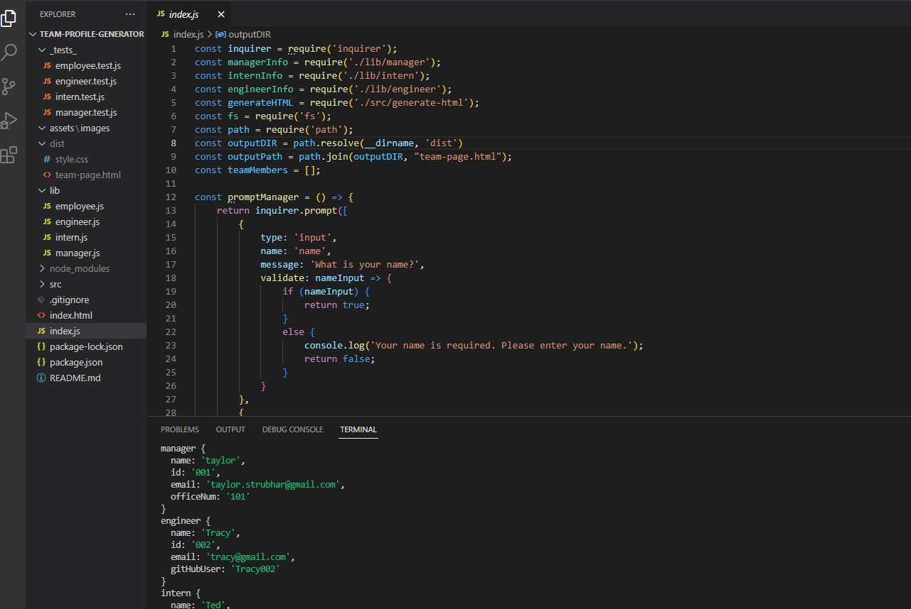

# team-profile-generator

## Description

This is a learning project for me in which a user can enter their team information through the command line and the app will produce an html file with their team details

## Table of Contents

* [Installation](#installation)
* [Usage](#usage)
* [License](#license)
* [Contributing](#contributing)
* [Tests](#tests)
* [Questions](#questions)

## Installation
'
This project utilizes jest and inquirer and is run through the command line.
'
## Usage

This project can be utilized to create a team profile html page by answering questions and making selections.

## License

This repository is using the MIT license.

## Contributing

This is a learning project for me but users may contribute if they feel so inclined.

## Tests

In order to run tests, please run the following:

` jest `

## Screenshot

## Questions

Questions about this repository should be directed to [taylor.strubhar@gmail.com](mailto:taylor.strubhar@gmail.com). View more of my work at [TaylorStrubhar](https://github.com/TaylorStrubhar)

